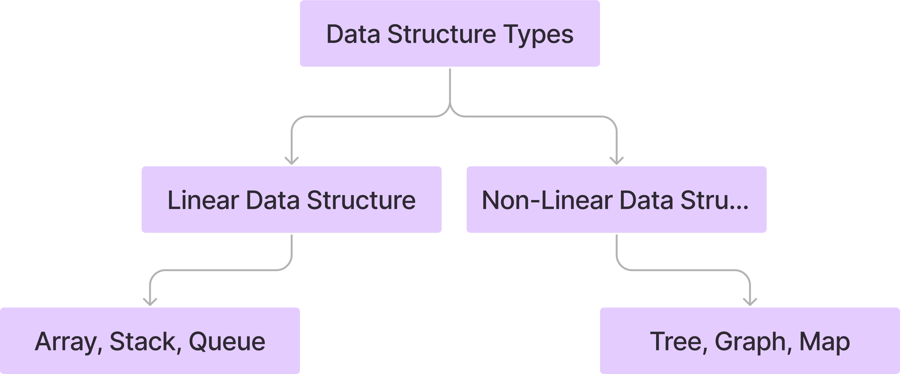
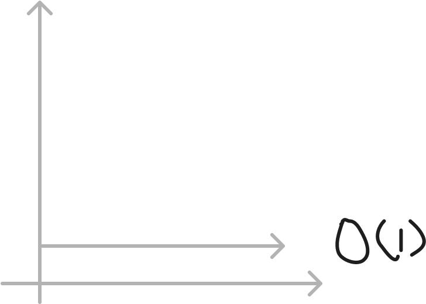
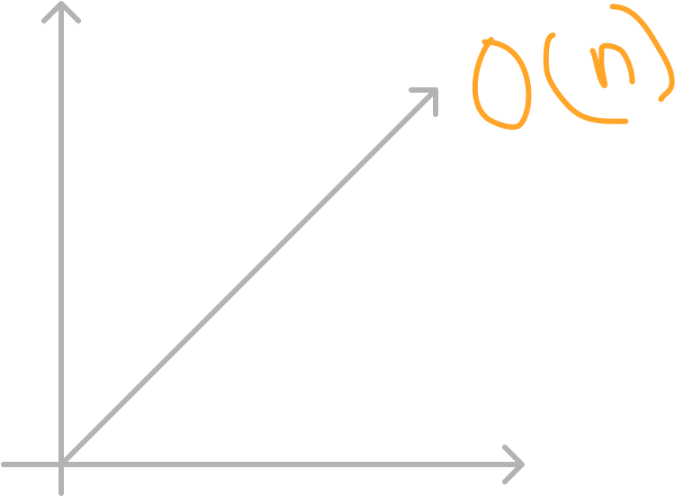

# Introduction to DSA (Data structure and Algorithm)

DSA stands for Data Structure and Algorithm. Data structure are ways of organizing and storing data in a computer so that can be accessed and modified efficiently.
Common data structures include arrays, linked lists, stacks, queues, trees, graphs, hash tables, and more. Each data structure has its own set of operations and properties that make it suitable for specific tasks.

## What is an Algorithm

An algorithm is a precise set of instructions designed to solve a problem effectively. It operates by accepting a defined set of inputs and systematically generates the desired output.

## Data Structure and Types

A data structure is a means of storing and arranging data in an organized manner.

<p align="center">
  
</p>

## Asymptotic Analysis: Big-O Notation

How well an algorithm works depends on how much time and storage it needs to do its job. We measure this using something called asymptotic notations.

**There are mainly three asymptotic notations**

- Big O notation
- Omega notation
- Theta notation

**Big(O) notation**

- **O(1) constant** -> O(1) describes an algorithm whose execution does not depends on the size of the input data. for example refer the below code file. <br>
   <p align="center">
    
  </p>
[constant time complexity code](<../src/Big(O)/constant_time.js>)

- **O(n) linear** -> O(n) time complexity means that as you increase the input size, the time it takes for the algorithm to run also increase at the same rate.
<p align="center">
    
</p>

[linear time complexity code](<../src/Big(O)/linear_time.js>)

<hr>
<hr>

<!-- Arrays -->

## Arrays

An array is a data structure used to store multiple elements.

```javascript
const arr = [1, 2, 43, 5, 6];
console.log(arr);
```
