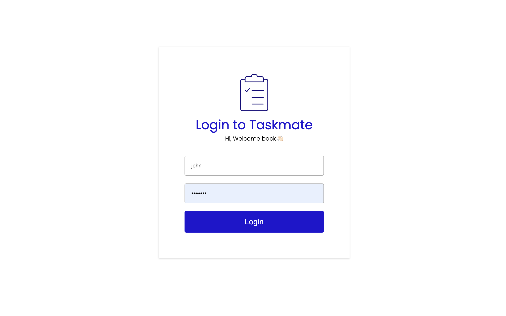
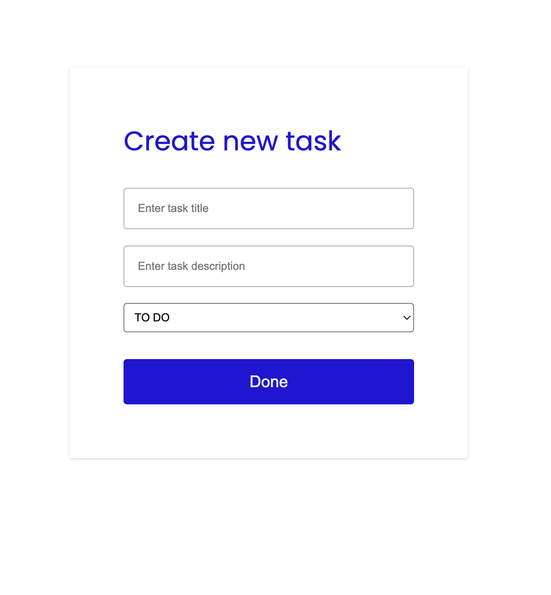
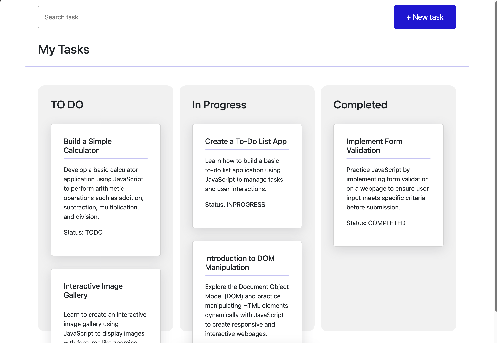
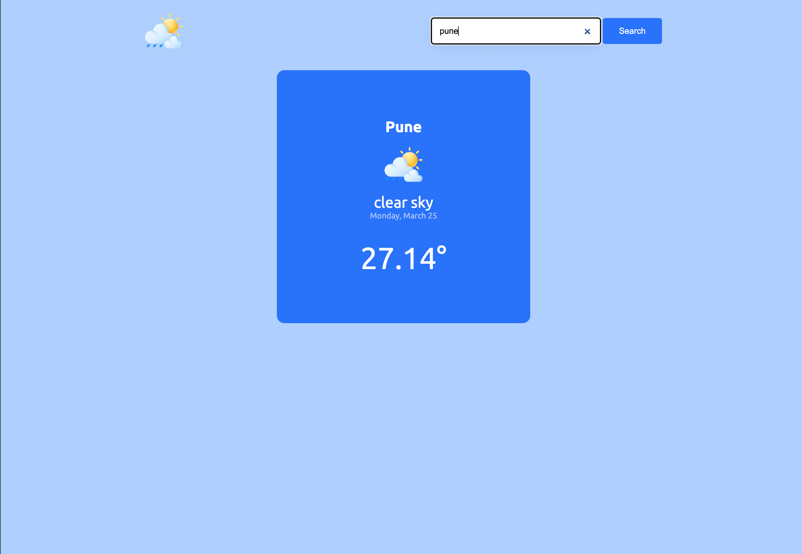

# Project Portfolio

This repository contains a collection of projects focusing on HTML, CSS, JavaScript, Data Structures and Algorithms (DSA), React, and Express.

## Table of Contents

- [HTML/CSS Projects](#html-css-javascript-projects)
- [Data Structures and Algorithms (DSA) Projects](#data-structures-and-algorithms-dsa-projects)
- [React Projects](#react-projects)
- [Express Projects](#express-projects)

## HTML/CSS and Javascript Projects

1. **Project Name**: [TaskMate](./javascript/Taskmate/html/login.html)

   - **Description**: A simple TODO application to manage tasks.
   - **Technologies Used**: HTML, CSS, JS
   - **Additional Notes**: This project allows users to add, delete, and mark tasks as completed. It's built using HTML and CSS for the user interface. Future updates may include integrating JavaScript for dynamic functionality and improving user experience.
   - **URL**: [Taskmate](https://thesyscoder.github.io/LevelUpJS/)
   - **Preview**  
     
     
     

2. **Project Name**: [SkySense](./javascript/SkySense/index.html)

   - **Description**: SkySense is a simple weather application that allows users to check the current weather conditions for their location.
   - **Technologies Used**: HTML, CSS, JS
   - **Additional Notes**: user's location or allows manual input of location
   - **URL**: [Skysense](https://thesyscoder.github.io/LevelUpJS/)
   - **Preview**  
     

## Data Structures and Algorithms (DSA) Projects

## React Projects

## Express Projects
